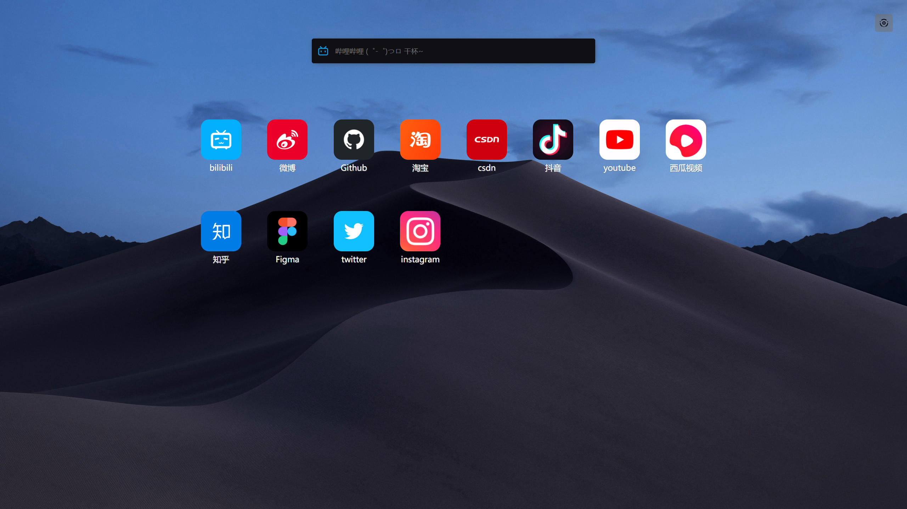

<h1 align="center">
🧭 XGNavigation 🧭
</h1>

A browser home page extension.

一个浏览器首页扩展

<a href="https://xxggg.github.io/XGNavigation/"><b>Web</b></a>

<!-- 

 <a href="">Chrome</a> | <a href="">Edge</a> | <a href="">QQ浏览器</a> | <a href="">360浏览器</a>

 -->

 
 

## 📖 介绍

😅 emmmm....

1. 这是一个浏览器首页扩展，他的灵感最初来源于【QQ浏览器-PC端】的首页，我希望拥有一个干净整洁、可自定义的【浏览器首页】！而不是像【hao123】或者是【浏览器自带首页】那种，要么很乱很杂，用得到的用不到的都摆放在首页......它们不够方便！不够整洁！  
2. 我希望的是：常用书签像手机App一样😊可爱的摆放在首页，⚒️工具类书签能一键直达！
3. 最后编写的时候参照了最热门的【Infinity】 
4. 目前这个插件还在完善中....

虽然这是一个浏览器扩展，但是它不像其他功能类浏览器扩展需要用到【注入JS、CSS】等...   
只是配置了几项，就能让它成为浏览器首页，这比在【浏览器-设置】中设置一个网页为【新打开】时更优！  

但是它本质还是一个【网页】！  
所以开发时，我用到了熟悉网页开发技术，并且使用了关于Vue的技术栈👇

## 🚀 记录

### 使用了👇 
1. Vite3 + Vue3 + TypeScript
2. [NaiveUI](https://www.naiveui.com/zh-CN/os-theme)
3. indexedDB - [localforage](http://localforage.docschina.org/)
4. 浏览器扩展配置
5. ......

😄 记录一下，这个项目我使用了那些有趣的效果👇  

- 图标的拖拽：使用的是H5的拖拽（Drag 和 Drop）
- 各种动画效果：Vue的 `TransitionGroup` 和 `Transition` 以及CSS3的 `animation` 和 `transition`
- 响应式图片投影：使用了H5的 `Canvas` 和 JS 计算出图片综合颜色！
- 持久化数据存储：indexedDB - [localforage](http://localforage.docschina.org/) 
- ......

更多记录：[谢夏戈的博客 | 🧭 XGNavigation](https://xxggg.github.io/Project/XGNavigation.html)

## 🖼️ 展示

  
